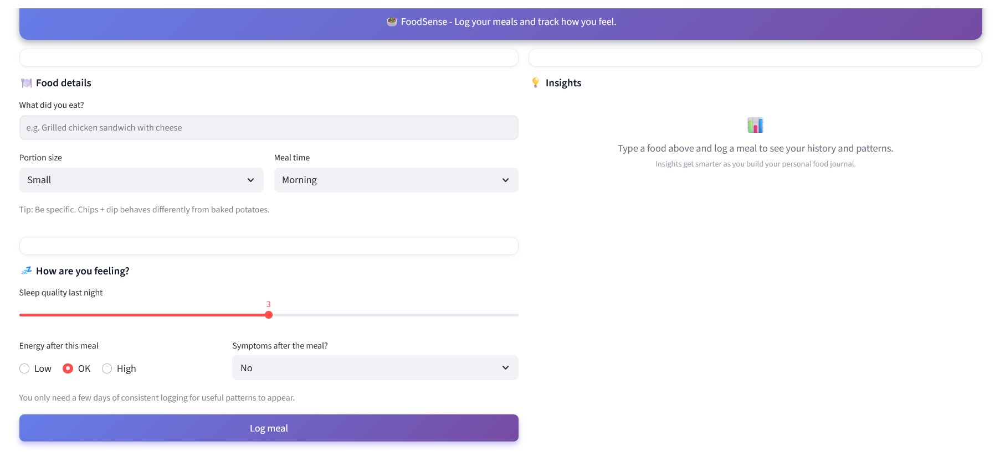

# FoodSense  
**Personal Health Analytics Platform | Python · Streamlit · Data Analysis**

*Turning messy food logs into actionable health insights.*

🔗 **Live App:** https://data-sous-shaif-foodsense-appstreamlit-app-liml0a.streamlit.app

## Problem
After logging 200+ meals, I found that symptoms were inconsistent and difficult to interpret in raw data. Patterns felt real, but they were not visible when looking at individual meal logs.

I built **FoodSense** to transform messy, self-tracked food data into clear, data-backed insights that support better decisions rather than guesswork.

---

## What I Built
An end-to-end analytics prototype that converts unstructured health data into interpretable patterns using exploratory analysis and visualization.

- Interactive Streamlit application for logging, analyzing, and reviewing meals and symptoms  
- Statistical analysis across 5+ variables per meal (food type, portion size, timing, sleep quality, stress level)  
- Automated category-level aggregation to surface non-obvious correlations hidden in raw logs  

## Data Source & Design

The dataset used in this project was **synthetically generated using a rule-based data generation script in Python**.

Rather than relying on purely random data, the generation logic was intentionally designed to simulate realistic food–symptom relationships, including:
- Higher symptom probability for dairy, gluten, and large portions
- Interaction effects with sleep quality, stress level, coffee intake, and meal timing
- Non-uniform symptom types based on food category

This approach allowed the analysis to reflect realistic, noisy, real-world patterns while avoiding the use of personal or sensitive health data.




---

## Key Insights
📊 **Food category signal emerged from noise**  
Dairy- and carb-heavy meals showed **65–80% symptom rates**, compared to **25–30%** for protein-forward meals.

📏 **Portion size amplified risk, but didn’t cause it**  
Larger portions increased symptom occurrence by ~40%, but only for already high-risk food categories.

🧠 **Context mattered**  
Poor sleep combined with high stress **nearly doubled symptom likelihood**, regardless of food type.

🍳 **Preparation style > ingredients**  
Rich, dairy-heavy cooking methods consistently clustered in high-risk outcomes, while simpler preparations were better tolerated.

---

## Technical Highlights
- Cleaned and structured raw CSV data using **Pandas** with SQL-style aggregations  
- Performed exploratory and grouped analysis to detect patterns across food, behavior, and context  
- Built a responsive **Streamlit** app with session-state handling and persistent logging  
- Implemented logic to identify interaction effects between variables (food × portion × context)  
- Designed a single-screen UI optimized for quick interpretation rather than complex navigation  

---

## Impact
Converted **200+ real-world meal logs** into a practical decision-support system that extracts signal from noisy, imperfect data—demonstrating applied analytics, not just visualization.

This project reflects how real data analysis works: incomplete data, subjective inputs, and patterns that only emerge through structured aggregation and thoughtful interpretation.

---

## Repository Structure

```text
.
├── app/              # Streamlit application source code
├── data/             # Synthetic dataset used for analysis
├── analysis/         # Exploratory analysis and insight generation
├── requirements.txt  # Project dependencies
└── README.md         # Project documentation
